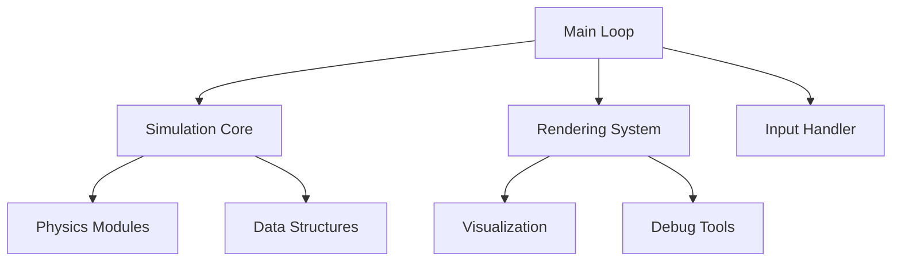

# Fluid Simulation Project in Zig

## Overview

This project is primarily an educational exploration of **low-level programming**, **software design**, and **algorithm implementation** through the lens of fluid simulation. Rather than aiming for production-grade physics accuracy, it focuses on:

1. **Core Programming Concepts**: Memory management, performance optimization, and data-oriented design
2. **Software Architecture**: Building modular, extensible systems
3. **Algorithm Implementation**: Practical application of numerical methods and computational physics

## Learning Objectives

### 1. Low-Level Programming Mastery
- **Memory Management**: Explicit allocation/deallocation patterns in Zig
- **Performance Optimization**: Cache-aware data structures and hot-loop optimization
- **Hardware Interaction**: Understanding how algorithms map to hardware behavior

### 2. Software Design Principles
- **Modular Architecture**: Clean separation between:
  - Simulation core
  - Rendering system
  - Input handling
- **Extensibility Patterns**: Implementing new simulation methods via:
  - Component-based design
  - Interface abstractions
- **API Design**: Creating reusable, well-documented interfaces

### 3. Algorithm Implementation
- **Numerical Methods**:
  - Finite difference schemes
  - Linear algebra operations
  - Iterative solvers
- **Computational Patterns**:
  - Structured grid operations
  - Particle systems
  - Hybrid approaches

## Technical Implementation

### Core Architecture

### Key Components
1. **Simulation Core**:
   - Swappable algorithm implementations
   - Unified memory management
   - Time-stepping controller

2. **Rendering Interface**:
   - Abstracted visualization layer
   - Multiple display modes (scalar/vector fields)
   - Performance metrics overlay

3. **Extension Points**:
   - New physics models via interface implementation
   - Custom visualizers via plugin system
   - Alternative numerical solvers

## Educational Value

This project serves as:
- A **reference implementation** for computational physics concepts
- A **case study** in balancing performance and abstraction
- A **demonstration** of Zig's unique capabilities for systems programming

## Contributing

We welcome contributions that:
- Improve code clarity and educational value
- Add well-documented implementation variants
- Enhance architectural patterns

See [CONTRIBUTING.md](CONTRIBUTING.md) for guidelines.

## License

[MIT License](LICENSE)

## Acknowledgments

Special thanks to:
- The Zig community
- Educators and researchers who have developed accessible explanations of fluid dynamics
- Open source projects that demonstrate effective software architecture patterns

https://github.com/user-attachments/assets/ec84c425-4f5e-4005-91e1-f7f8794f6a3f

